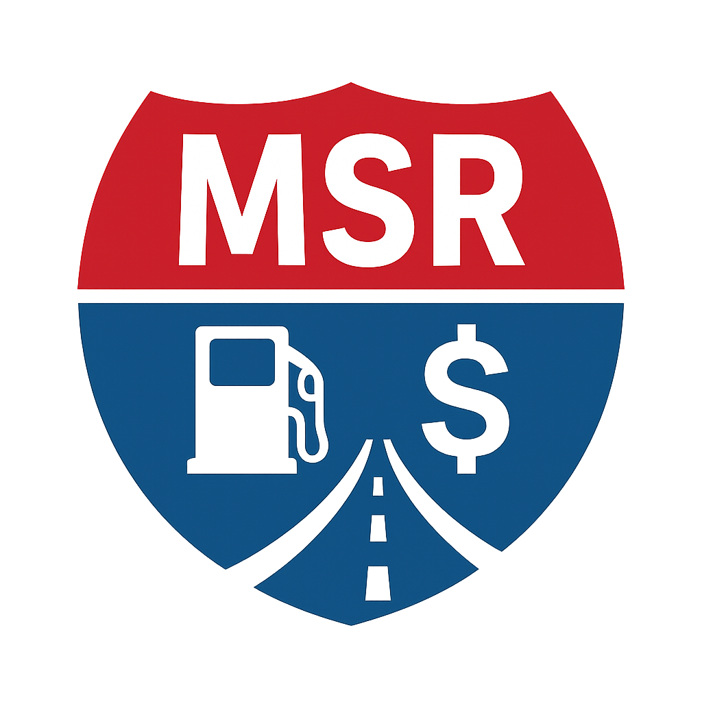

  

<h1 align="center">🚛 My Smart Road (MSR)</h1>

<em>Navigate smarter. Drive farther. Earn more.</em>

---

## 🧭 Overview

**My Smart Road (MSR)** — AI-driven route optimizer for owner-operators and small fleets.  
It helps truckers save fuel, avoid toll overpay, and optimize IFTA reporting — automatically.

---

## ✨ Key Features

- 🧠 **AI Route Optimization:** Smart planning based on distance, cost, and time.
- ⛽ **Fuel Price Comparison:** Live updates for TA, Pilot, Loves, and Petro networks.
- 💵 **IFTA Automation:** Tracks miles per state and exports quarterly reports.
- 🛣 **Smart Fuel Strategy:** Recommends where to fill up (partial vs. full) for best savings.
- 🌦 **Weather & Traffic Alerts:** Notifies about closures, wind, snow, or heavy rain.
- ⚖️ **Weigh Stations & Rest Stops:** Integrated visibility and status updates.

---

## ⚙️ Tech Stack

| Layer | Technology |
|-------|-------------|
| Frontend | React Native / Expo |
| Backend | FastAPI (Python) / Node.js |
| Database | Firebase / Supabase |
| Design | Figma + Tokens Studio + Galileo AI |
| APIs | Fuel, Weather, Toll, IFTA |

---

## 📅 Roadmap

| Phase | Goal | ETA |
|-------|------|-----|
| Phase 1 | Design & Figma Prototype | ✅ Done |
| Phase 2 | Mobile MVP (Route + Fuel) | In Progress |
| Phase 3 | IFTA & Toll Automation | Q1 2026 |
| Phase 4 | AI-Driven Optimization | Q2 2026 |

---

## 🧩 Vision

MSR aims to make road operations intelligent, efficient, and stress-free.  
Our belief: **AI should simplify — not complicate — the driver’s life.**

---

📘 **Full documentation:** [View here →](docs/README.md)

---

© 2025 **Lafwiron Projects** — All Rights Reserved.
